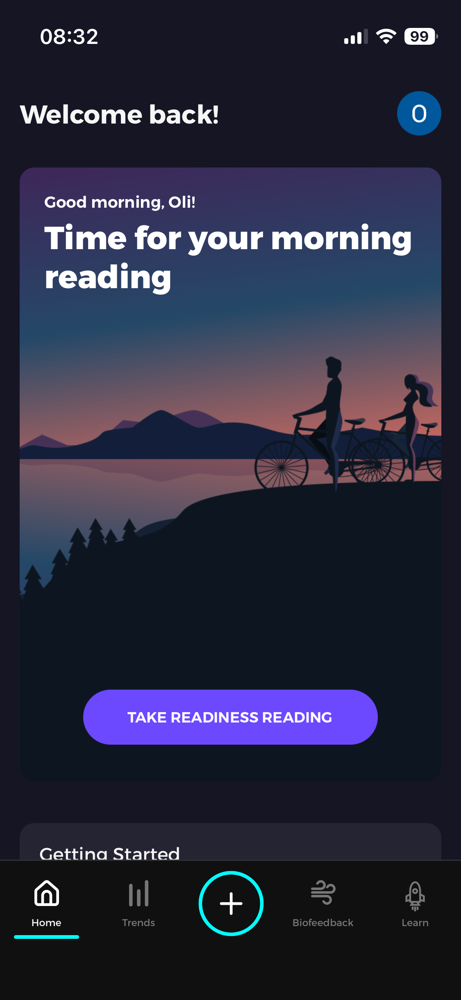
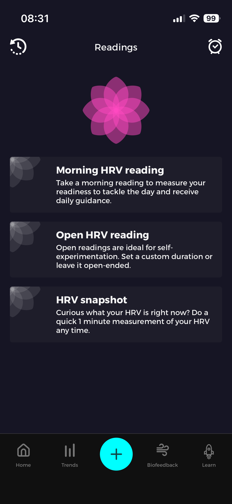
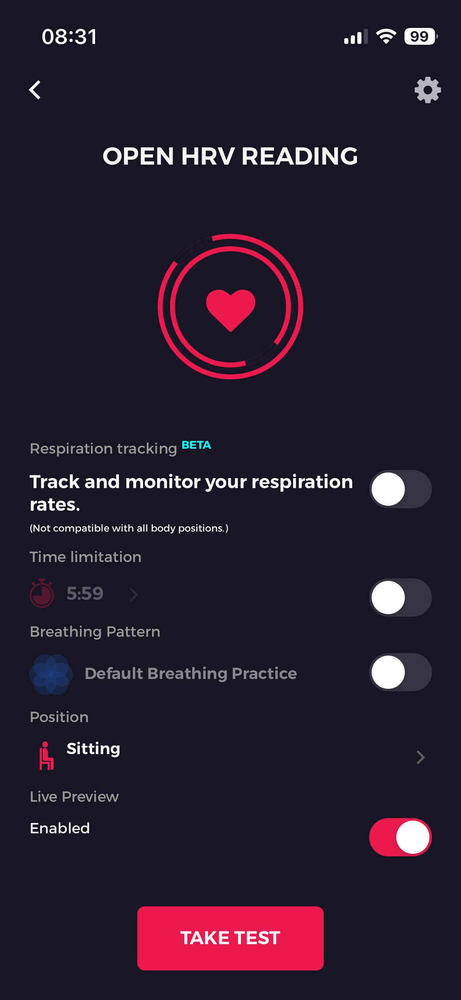
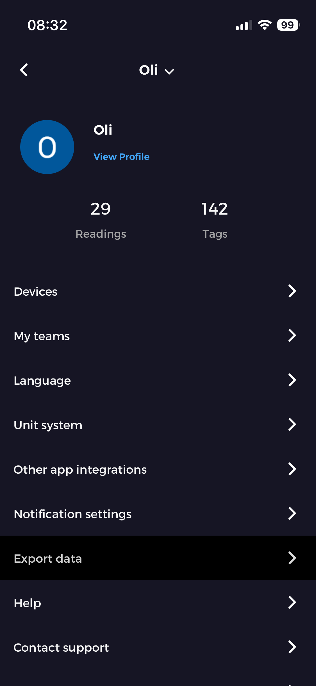

# HRV Resonance Frequency Toolkit

After learning about resonance breathing I was very interested in determining my own personal resonant frequency (RF). I spent several evenings researching, pulling together different tools and using Claude Code to develop an accessible way of determining RF. The method uses the Fisher-Lehrer RF protocol to determine RF using a heart rate monitor / EliteHRV app or using a Polar H10 and a more sophisticated desktop python app. The documentation below is AI generated (although has been edited for accuracy) and is just provided as a clear set of instructions for how to use these adapted tools I've hacked together! 

---- 
A collection of tools for determining your **Resonance Frequency (RF)** — the breathing rate (typically 4.5–7 bpm) at which heart rate variability is maximised. Training at your RF is the basis of HRV biofeedback therapy.

This repo combines:

- **HRVisualizer** — a Windows desktop app (and Python port) for analysing HRV sessions and reading RF from the power spectrum. Developed by Gibson Research Corporation for the Fisher & Lehrer (2021) study; open-source ZIP at [breath.cafe](https://breath.cafe/).
- **Every Breath You Take (EBYT)** — a Python/PySide6 app for live Polar H10 BLE streaming with real-time HRV biofeedback. Forked from [kieranabrennan/every-breath-you-take](https://github.com/kieranabrennan/every-breath-you-take) by Kieran Brennan (MIT license), extended here with the Fisher–Lehrer RF protocol and HRVisualizer-compatible export.
- **Converter scripts** — for importing Elite HRV + breath.cafe data into HRVisualizer when you don't have a computer with you during a session.

---

## Background: What is Resonance Frequency?

At your RF, slow breathing entrains a large RSA (respiratory sinus arrhythmia) — heart rate rises on inhale and falls on exhale in a pronounced sine wave, producing a sharp peak in the HRV power spectrum. Finding this frequency requires testing several rates and observing where HRV amplitude is highest.

The Fisher–Lehrer graduated protocol sweeps from ~6.75 bpm down to ~4.25 bpm over 15 minutes, letting you identify the peak in a single session. Protocol details and supporting software are described in:

> Fisher, S.F. & Lehrer, P.M. (2021). Resonance frequency biofeedback: A sliding scale approach. *Applied Psychophysiology and Biofeedback.* DOI: [10.1007/s10484-021-09524-0](https://doi.org/10.1007/s10484-021-09524-0)

---

## Methods

There are two main routes depending on your equipment:

| Route | Hardware needed | Notes |
|-------|----------------|-------|
| **A – Mobile (EliteHRV + breath.cafe)** | Phone + any chest strap | Simpler setup; synthetic respiration waveform reconstructed from protocol schedule; requires careful manual start-time sync |
| **B – Computer live streaming (EBYT)** | Polar H10 + laptop/desktop with BT | Records real breathing via accelerometer; timing automatic; more accurate |

Both routes produce a HRVisualizer-compatible `.txt` file. RF is read from the resulting HRV frequency plot.

---

## Route A: EliteHRV + breath.cafe → HRVisualizer

Use this route when you only have a phone and a heart rate monitor — no laptop needed during the session. You can even send your export file to someone else for processing.

> **Note:** Route B (EBYT) is more accurate — it records your actual breathing via the Polar H10 accelerometer, and timing is handled automatically. Route A reconstructs a synthetic respiration waveform from the protocol schedule, which is sufficient for reading your RF peak but less precise.

### Overview

1. Open the breath.cafe pacer in a browser
2. Record a 15-minute session in EliteHRV, starting both at the same moment
3. Export your data from EliteHRV and identify the right file
4. Run the converter to produce a HRVisualizer file

---

### Step 1 — Open the breath.cafe pacer

Open [https://breath.cafe/](https://breath.cafe/) in a browser on any device, or open `breath_cafe_research_protocol.html` locally for the full automated Fisher–Lehrer sweep (6.75 → 4.25 bpm).

Have it ready but **do not start it yet**.

---

### Step 2 — Start a recording in EliteHRV

**2a.** Open EliteHRV. On the home screen, tap the **+** button at the bottom of the screen.



**2b.** You will see three reading types. Select **Open HRV reading**.



**2c.** On the Open HRV Reading screen:
- Leave **Time limitation** toggled **off** — the app caps it at 5:59, so you need an open-ended session to run the full 15 minutes. If you'd prefer the session to stop automatically, use the **Resonance** or **Custom Breathing** mode instead and set a 15-minute timer there — just ignore the app's breathing instructions and follow the breath.cafe pacer as normal
- **Position** is **sitting** as default - has no bearing on the reading, although a good idea to do the protocol sitting!
- Leave all other toggles off (Respiration tracking, Breathing Pattern, etc.)
- Make sure your heart rate monitor is connected (shown at the top of the screen)



**2d.** **Start the breath.cafe pacer and tap TAKE TEST at the same moment.** This synchronisation is the key step — the converter uses the pacer's known protocol schedule to reconstruct the respiration waveform, aligned from the start of the recording.

Breathe for the full 15 minutes following the pacer, then let the session end naturally.

---

### Step 3 — Export your data from EliteHRV

**3a.** From the home screen, tap your profile icon (top right corner). Then tap **Export data**.



**3b.** EliteHRV will export **all of your previous readings** as a collection of files. Each reading is saved as a separate `.txt` file named with its date and time.

**Find the file that matches your 15-minute session** — it will be named something like:
```
2026-03-25 20-30-00.txt
```

Send that file (and only that file) for processing.

---

### Step 4 — Convert to HRVisualizer format

```bash
python3 quick_rf_test.py "2026-03-25 20-30-00.txt"
```

The script generates the Fisher–Lehrer breath schedule automatically and writes the output as `rf_test_YYYYMMDD_HHMMSS.txt` in the current directory.

`elitehrv_to_hrvisualizer.py` is a more flexible version if you need to specify a custom breath schedule, output filename, or start time — but for a standard 15-minute Fisher–Lehrer session `quick_rf_test.py` is all you need.

---

### Step 5 — Open in HRVisualizer

See [Viewing results in HRVisualizer](#viewing-results-in-hrvisualizer) below.

---

## Route B: Live streaming with EBYT (Polar H10 required)

The **Every Breath You Take** app connects directly to a Polar H10 over Bluetooth and streams ECG-grade RR intervals + chest accelerometer (breathing) in real time. It runs the Fisher–Lehrer protocol automatically and exports a HRVisualizer file at the end of the session.

### Prerequisites

- **Polar H10** chest strap (firmware 5.0.0 or later)
- Mac, Linux, or Windows PC with Bluetooth LE
- Python 3.9–3.12

### Installation

```bash
cd every-breath-you-take
python -m venv venv
source venv/bin/activate      # Windows: venv\Scripts\activate
pip install -r requirements.txt
```

### Running

```bash
cd every-breath-you-take
source venv/bin/activate
python EBYT.py
```

On macOS you can double-click `EveryBreathYouTake.command` instead.

The app will scan and connect to your Polar H10 automatically. Ensure the strap is fitted snugly around the widest part of the ribcage.

### Doing an RF session

1. **Wear the Polar H10** and wait for it to connect (green indicator in the app).
2. **Select a protocol** from the Protocol dropdown:
   - *Fisher–Lehrer* — graduated sweep 6.75 → 4.25 bpm over 15 minutes (recommended for first RF determination)
   - *Manual* — set the breathing rate yourself
3. **Start the pre-roll**: sit quietly for 1–2 minutes to stabilise. The pacer runs but data is not yet saved.
4. **Click "Start Session"**: this sets the session start time and begins recording. Follow the expanding/contracting gold circle pacer.
5. **Breathe diaphragmatically**: belly expands on inhale, chest stays still. Nose in, nose or pursed-lip out. Passive, relaxed exhale — do not force lungs empty.
6. **After 15 minutes** (or when the protocol ends): click "Stop & Export".
7. The app saves a HRVisualizer-compatible `.txt` file to `every-breath-you-take/exports/`.

### Real-time display

- **Top graph**: raw RR intervals (beat-to-beat HR) and breathing trace
- **Middle graph**: HR oscillation (RSA) — you are looking for a large, smooth sine wave
- **Bottom graph**: HRV frequency spectrum — look for the spectral peak to grow and sharpen as you approach your RF

### Exporting

On "Stop & Export" the app writes two files:
- `exports/YYYY-MM-DD_HH-MM-SS.txt` — HRVisualizer NeXus format
- `exports/YYYY-MM-DD_HH-MM-SS_raw.txt` — raw debug data

---

## Viewing results in HRVisualizer

HRVisualizer analyses the session and displays a frequency spectrum showing where HRV amplitude peaked. Your RF is the frequency of the highest peak in the **RSA band** (roughly 0.05–0.15 Hz / 3–9 bpm).

**To open a session: drag and drop the `.txt` file onto the HRVisualizer window.** Both the Python port and the original Windows app work the same way.

### Python port (macOS / Linux / Windows)

`hrvisualizer.py` is a full Python/PySide6 port of the original VB.NET HRVisualizer, producing identical results.

**macOS:** double-click `HRVisualizer.command`, then drag your `.txt` file onto the window.

**All platforms (command line):**

```bash
# Install (one-time, uses the EBYT venv)
cd every-breath-you-take && source venv/bin/activate && pip install pyqtgraph && cd ..

# Launch and drag-drop a file onto the window
python hrvisualizer.py

# Or open a file directly
python hrvisualizer.py path/to/session.txt
```

**Controls:**
- Drag and drop a `.txt` file onto the window to load it
- Mouse wheel: zoom in/out on time axis
- Click and drag scrollbar: pan
- Checkboxes: toggle ECG / respiration traces
- "B&W" button: black and white mode
- "Copy": copy chart to clipboard

### Original Windows app

The compiled Windows app is in `Nexus/Nexus/bin/x86/Release/`. Double-click `HRVisualizer.exe` to launch, then **drag and drop your `.txt` file onto the window**.

**Requirement:** Microsoft Chart Controls for .NET 3.5 must be installed for the app to run. The full original download (including this installer) is available from the original source:
[breath.cafe/HRVISUALIZER_WITH_SOURCE_CODE.ZIP](https://breath.cafe/HRVISUALIZER_WITH_SOURCE_CODE.ZIP)

To build from source: open `Nexus/Nexus.sln` in Visual Studio.

---

## Reading your RF

HRVisualizer automatically calculates and displays your RF — it appears in the window title bar and status bar at the bottom of the screen. A dashed vertical line marks the peak on the chart. Typical values are 4.5–6.5 bpm.

---

## Repository structure

```
├── hrvisualizer.py                 Python port of HRVisualizer
├── elitehrv_to_hrvisualizer.py     Convert EliteHRV + breath.cafe → HRVisualizer
├── polar_to_hrvisualizer.py        Convert raw Polar H10 data → HRVisualizer
├── generate_test_data.py           Generate synthetic test sessions
├── quick_rf_test.py                Quick RF determination from RR file
├── convert_session.sh              Shell wrapper for elitehrv_to_hrvisualizer.py
├── HRVisualizer.command            macOS launcher for hrvisualizer.py
├── EveryBreathYouTake.command      macOS launcher for EBYT
│
├── breath_cafe_logger.html         Modified breath.cafe with CSV export logging
├── breath_cafe_research_protocol.html  Fisher–Lehrer automated stepped protocol
│
├── every-breath-you-take/          Polar H10 live streaming app (fork)
│   ├── EBYT.py                     Entry point
│   ├── Model.py                    Sensor callbacks, export orchestration
│   ├── View.py                     PySide6 GUI
│   ├── DataExporter.py             HRVisualizer NeXus format export
│   ├── ProtocolManager.py          Fisher–Lehrer + other protocols
│   ├── Pacer.py                    Visual breathing pacer
│   ├── sensor.py                   Polar H10 BLE interface
│   ├── analysis/
│   │   ├── BreathAnalyser.py       Accelerometer → breathing rate
│   │   ├── HrvAnalyser.py          RR intervals → HRV metrics
│   │   └── HistoryBuffer.py        Circular buffer
│   └── exports/                    Session output files (gitignored)
│
├── Nexus/                          Original VB.NET HRVisualizer source
│
└── test_data/
    └── Alyssa_Synthetic_Respiration.txt   Sample session (from original HRVisualizer)
```

---

## Attribution

### HRVisualizer and Breath Pacer
Developed by **Gibson Research Corporation** (Laguna Beach, CA) for the Fisher & Lehrer (2021) study.
Both tools are open-source. Contact: Lorrie@FisherBehavior.com (Lorrie Fisher, Fisher Behavior).

- Breath Pacer source (well-commented JavaScript): [breath.cafe](https://breath.cafe/) → right-click → View Source
- HRVisualizer source ZIP: [breath.cafe/HRVISUALIZER_WITH_SOURCE_CODE.ZIP](https://breath.cafe/HRVISUALIZER_WITH_SOURCE_CODE.ZIP)
- Digital supplement: [breath.cafe/research.pdf](https://breath.cafe/research.pdf)

The `Nexus/` directory and `hrvisualizer.py` port are based on the HRVisualizer source.

### Every Breath You Take
Original application by **Kieran Brennan**, MIT License.
Original repository: [github.com/kieranabrennan/every-breath-you-take](https://github.com/kieranabrennan/every-breath-you-take)
This fork adds:
- Fisher–Lehrer graduated RF protocol (`ProtocolManager.py`)
- HRVisualizer-compatible NeXus format export (`DataExporter.py`)
- Per-breath discrete rate stepping (as specified in the Fisher–Lehrer paper)

### Fisher–Lehrer RF Protocol
The sliding graduated protocol implemented in this repo is described in:

> Fisher, S.F. & Lehrer, P.M. (2021). Resonance frequency biofeedback: A sliding scale approach. *Applied Psychophysiology and Biofeedback.* DOI: [10.1007/s10484-021-09524-0](https://doi.org/10.1007/s10484-021-09524-0)

The Breath Pacer and HRVisualizer were developed by Gibson Research Corporation specifically for this study. Both programs are open-source (see above).

### breath.cafe
Breathing pacer web app by **Lorrie R. Fisher** — [breath.cafe](https://breath.cafe/).
The modified logger versions (`breath_cafe_logger.html`, `breath_cafe_research_protocol.html`) add CSV export and automated protocol stepping to the original.

---

## License

- `every-breath-you-take/` and this fork's extensions: MIT (see `every-breath-you-take/LICENSE`)
- `Nexus/` (original HRVisualizer source): as distributed by breath.cafe — check with the original author for terms
- Converter scripts and Python port (`hrvisualizer.py`): MIT
